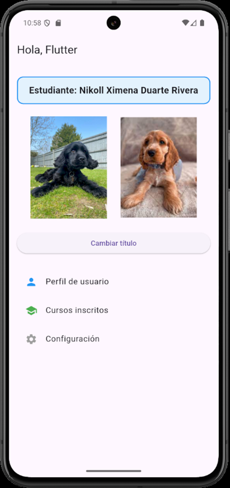
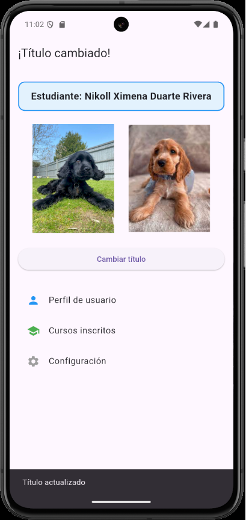

# taller_1

Este proyecto es un taller introductorio a **Flutter**, donde se implementa una pantalla principal con:
- AppBar dinámico.
- Texto con nombre del estudiante.
- Uso de imágenes (Image.network e Image.asset).
- Botón con setState y SnackBar.
- Widgets adicionales como Container y ListView.

## Getting Started

1. Clonar el repositorio o descargarlo.
   git clone <https://github.com/NikollduarteR/TalleresMoviles.git>

2. Entrar a la carpeta del proyecto:
   cd taller_1

3. Obtener dependencias:
   flutter pub get

4. Ejecutar en un emulador o dispositivo conectado:
   flutter run

## Capturas

## Datos del estudiante

- Nombre completo: Nikoll Ximena Duarte Rivera
- Código: 230221043