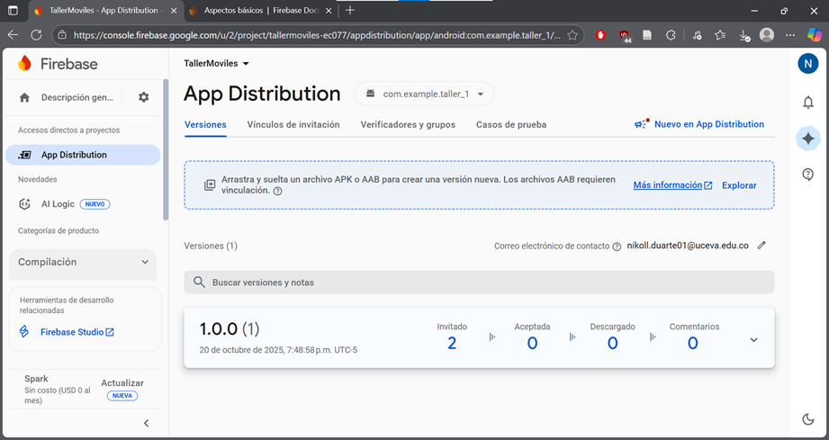
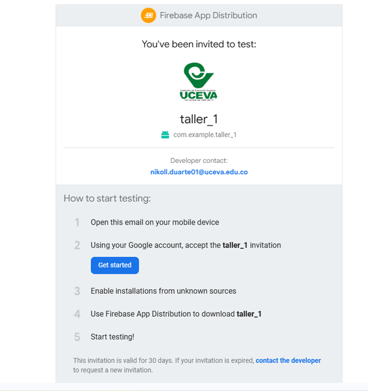
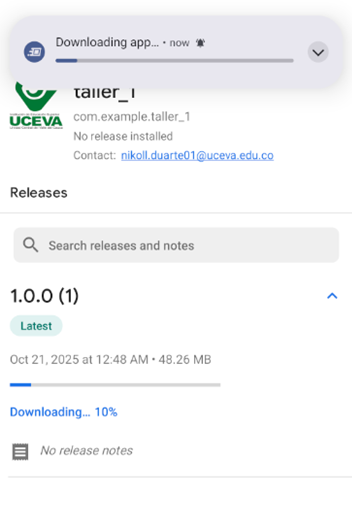
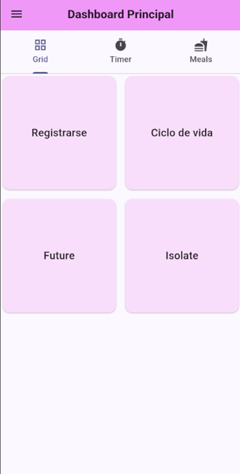
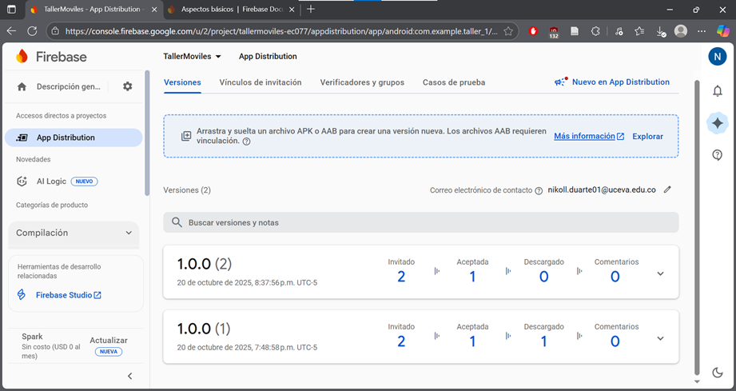

# Taller 1 

Este proyecto implementa la distribución de la aplicación móvil **MyRoute** utilizando **Firebase App Distribution** para gestionar versiones, testers y pruebas internas antes del despliegue oficial.  

El flujo completo abarca desde la generación del archivo APK/AAB hasta la instalación y actualización en los dispositivos de prueba.

---

## 🔄 Flujo General

1. **Generar APK o AAB**
   - Se compila la app Flutter en modo release.
   - Ejemplo:

     ```bash
     flutter build apk --release
     ```

   - El archivo se genera en:

     ```
     build/app/outputs/flutter-apk/app-release.apk
     ```

2. **Subir a Firebase App Distribution**
   - Desde la consola Firebase:
     - Ir a: **App Distribution → Releases**  
     - Hacer clic en **Agregar versión** y subir el `.aab` o `.apk`.
     - Completar las notas de versión (Release Notes) y seleccionar los testers.

3. **Invitar Testers**
   - Agregar los correos de los testers, por ejemplo:

     ```
     dduran@uceva.edu.co
     ```

   - Firebase enviará automáticamente un correo con el enlace de instalación.

4. **Instalación**
   - El tester recibe un correo con el enlace directo de instalación.
   - Debe aceptar la invitación y permitir la instalación desde fuentes confiables.

5. **Actualización**
   - Cuando se publica una nueva versión, Firebase notifica automáticamente a los testers para que actualicen.
   - La app mostrará los cambios (ejemplo: nueva vista de “Actualizaciones” dentro del menú lateral).

---

## 📦 Publicación

### Pasos resumidos para replicar el proceso

1. Verificar que la app funcione correctamente en modo debug.
2. Actualizar la versión en `pubspec.yaml`:
   ```yaml
   version: 1.0.1+2

3. Generar el archivo de build:
  ```
  flutter build appbundle --release
  ```

4. Acceder a Firebase Console → App Distribution.
5. Subir el .aab o .apk en la sección Releases.
6. Escribir las Release Notes:
  - Nueva pantalla de actualizaciones
  - Correcciones visuales menores
  - Optimización de carga
7. Seleccionar los testers y distribuir la app.
8. Verificar la recepción del correo e instalación exitosa.

## Capturas

## APP Distribution


## Correo de verificacion


## CaptInstalacion del APK


## APP 


## Nueva versión



## Datos del estudiante

- Nombre completo: Nikoll Ximena Duarte Rivera 
- Código: 230221043
