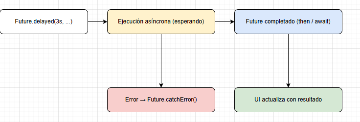
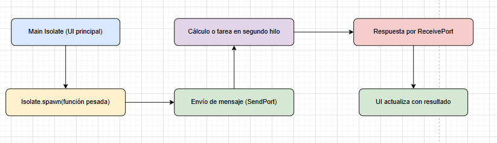
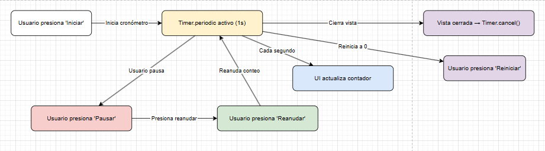

# taller 3 - Segundo plano, asincronía y servicios en Flutter

##  Descripción general
Este proyecto demuestra el uso de **asincronía en Flutter** mediante tres ejemplos prácticos:

- **Future / async / await:** Simulación de carga de datos con espera asíncrona.
- **Isolate:** Ejecución de tareas pesadas en segundo plano sin bloquear la interfaz.
- **Timer:** Cronómetro funcional con control total (iniciar, pausar, reanudar, reiniciar).

Cada vista se integra en una interfaz con pestañas (`TabBarScreen`) o mediante un menú tipo `GridView`, mostrando cómo Flutter gestiona procesos en segundo plano de forma eficiente.

---

## Flujo general del proyecto

### Menú principal (`GridViewWidget`)
El usuario accede al menú principal con varias opciones:
- **Registrarse**
- **Ciclo de vida**
- **Future**
- **Isolate**
- **Timer**

Cada tarjeta abre su respectiva pantalla.

---

## Flujos de ejecución

### 1. Future / async / await
**Objetivo:** Simular una carga de datos sin bloquear la UI.

**Flujo:**
1. El usuario presiona **“Cargar datos simulados”**.  
2. Se ejecuta una función `async` con `await Future.delayed(Duration(seconds: 3))`.  
3. Durante la espera, se muestra un indicador de carga (`CircularProgressIndicator`).  
4. Al finalizar, se actualiza la UI con los datos recibidos o un mensaje de error.

**Diagrama:**

---

### 2. Isolate (tarea pesada)
**Objetivo:** Ejecutar un cálculo intensivo sin bloquear la interfaz principal.

**Flujo:**
1. El usuario presiona **“Ejecutar tarea larga”**.  
2. Se crea un `ReceivePort` y se lanza un nuevo `Isolate`.  
3. El proceso pesado (p. ej. suma de números o bucles grandes) se ejecuta en segundo plano.  
4. Al terminar, el `Isolate` envía el resultado al hilo principal.  
5. La UI muestra el mensaje con el resultado final.

**Diagrama:**

---

### 3. Timer (cronómetro)
**Objetivo:** Actualizar un contador cada segundo y controlar su estado con botones.

**Flujo:**
1. El usuario puede presionar **Iniciar**, **Pausar**, **Reanudar** o **Reiniciar**.  
2. `Timer.periodic(Duration(seconds: 1))` actualiza el contador cada segundo.  
3. Si el usuario pausa o sale de la vista, se cancela el `Timer` para liberar recursos.

**Diagrama:**

---

## Cuándo usar cada mecanismo

| Mecanismo | Cuándo usarlo | Ejemplo |
|------------|----------------|----------|
| **Future** | Cuando se necesita ejecutar tareas **asíncronas cortas**, como llamadas HTTP, lectura de archivos o esperas simuladas. | Cargar lista de usuarios desde una API. |
| **async / await** | Para escribir código asincrónico más claro y legible, esperando resultados sin bloquear la UI. | Esperar respuesta de un servidor o base de datos. |
| **Timer** | Para ejecutar acciones **periódicas o con retardo**, como cronómetros o animaciones. | Cronómetro, cuenta regresiva, refrescar datos cada X segundos. |
| **Isolate** | Para tareas **pesadas de CPU** que bloquearían la interfaz principal si se ejecutan directamente. | Procesamiento de datos, cifrado, simulaciones, cálculos grandes. |

---

## Buenas prácticas

- Cancelar `Timer` en `dispose()` para evitar fugas de memoria.  
- Usar `mounted` antes de `setState()` después de operaciones asincrónicas.  
- No usar `Isolate` para tareas simples, solo para procesos realmente pesados.  
- Mostrar siempre los estados de la operación (loading, success, error).  

---

## Datos del estudiante

- Nombre completo: Nikoll Ximena Duarte Rivera
- Código: 230221043