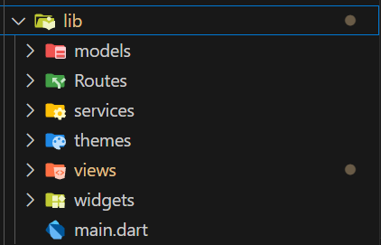

# Taller 4 - HTTP  

Aplicación Flutter que consume la API pública **TheMealDB** para mostrar recetas de comidas, sus detalles e ingredientes.  
El proyecto implementa **navegación con `go_router`**, manejo de **variables de entorno con `flutter_dotenv`**, y una **arquitectura modular** con carpetas bien definidas.

---

## Descripción de la API

**API utilizada:** [TheMealDB](https://www.themealdb.com/api.php)

**Endpoint principal:**
https://www.themealdb.com/api/json/v1/1/search.php?s=

**Ejemplo de uso:**
GET https://www.themealdb.com/api/json/v1/1/search.php?s=Migas

**Ejemplo de respuesta JSON:**

json
{
  "meals": [
    {
      "idMeal": "53086",
      "strMeal": "Migas",
      "strCategory": "Miscellaneous",
      "strArea": "Spanish",
      "strInstructions": "Crumble the bread into small pieces. Sprinkle...",
      "strMealThumb": ""https://www.themealdb.com/images/media/meals/xd9aj21740432378.jpg"
    }
  ]
}

## Arquitectura del proyecto

## Navegación con go_router

Las rutas se manejan desde el archivo app_router.dart

Ruta para listado de comidas
    GoRoute(
      path: '/meals',
      name: 'meals',
      builder: (context, state) =>
          const MealListView(), // Pantalla de lista de comidas
    ),

Ruta para detalle de una comida
    GoRoute(
      path: '/meal/:id', // se envía id y nombre como parámetros
      name: 'meal_detail',
      builder: (context, state) {
        final id = state.pathParameters['id']!;
        return MealDetailView(mealId: id);
      },
    ),

**Parámetros:**
/ → Página principal (listado de comidas)
/detail/:id → Página de detalle, recibe el parámetro id del platillo

## Capturas 

## Datos del estudiante

- Nombre completo: Nikoll Ximena Duarte Rivera 
- Código: 230221043
